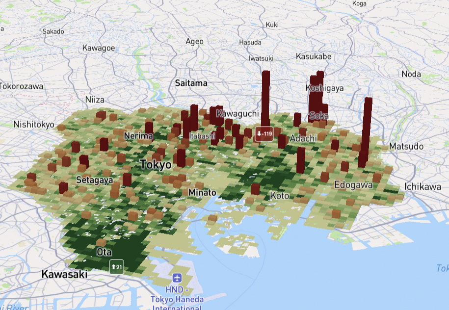
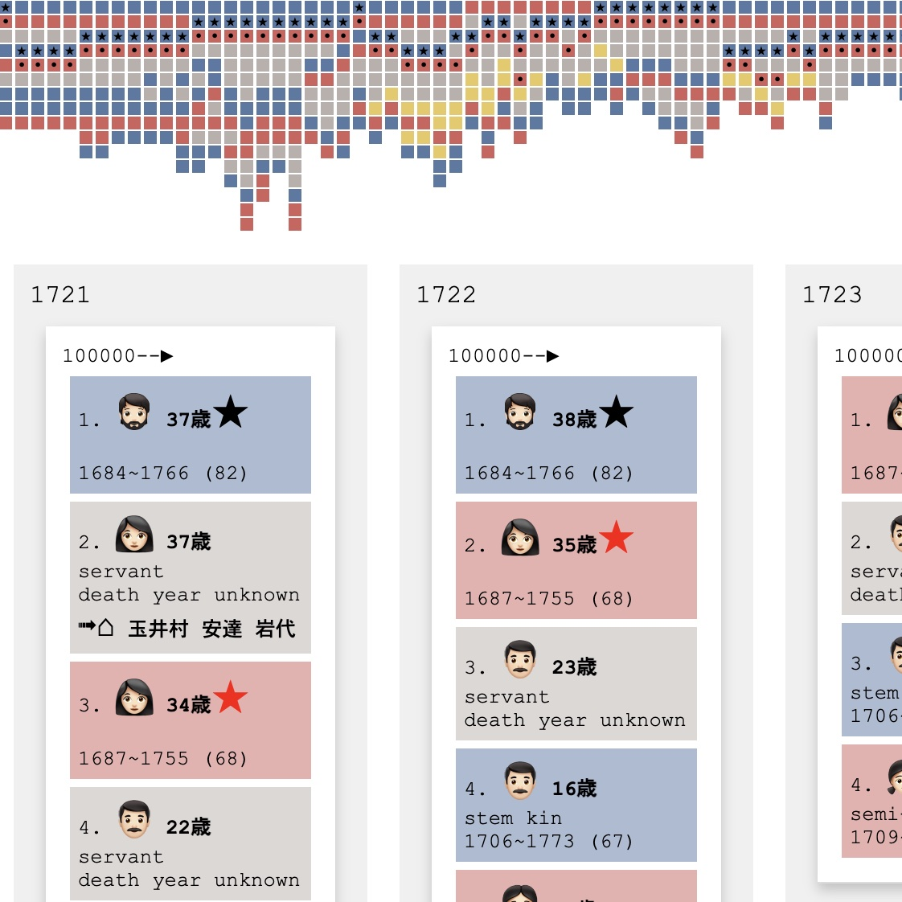
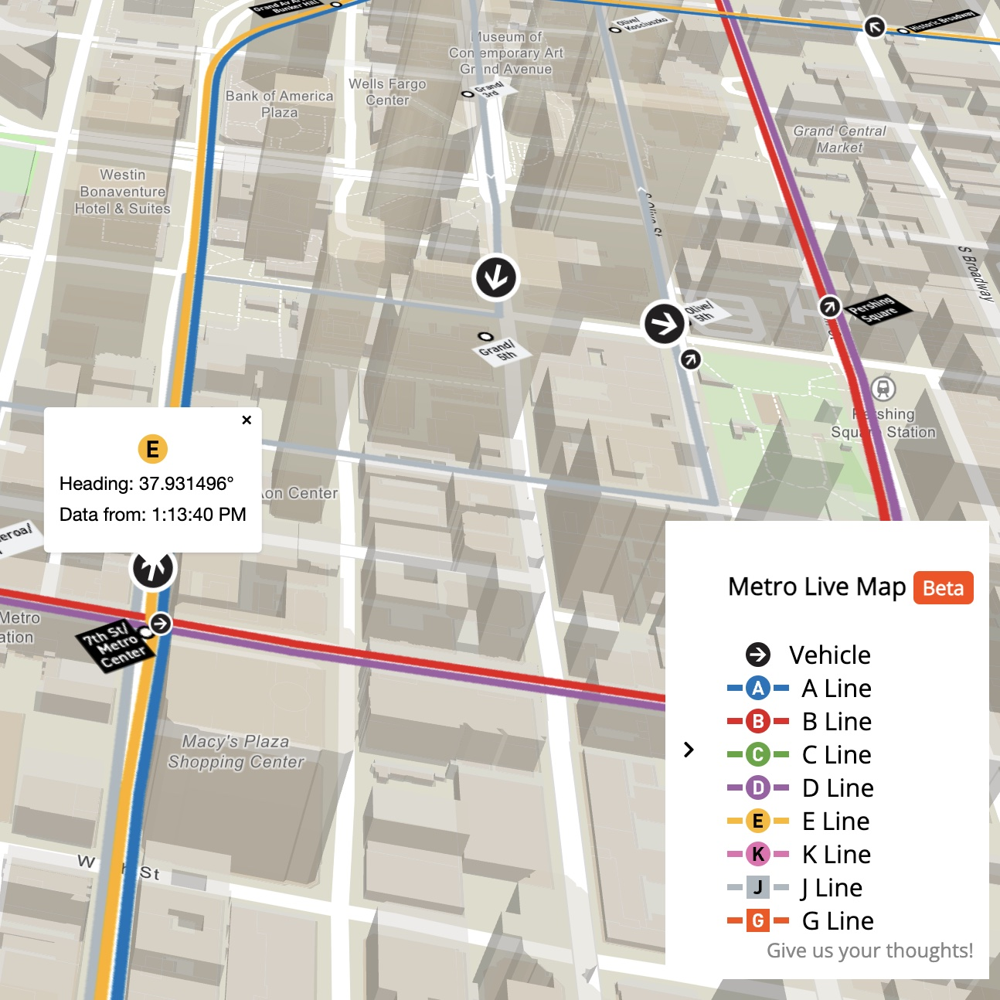
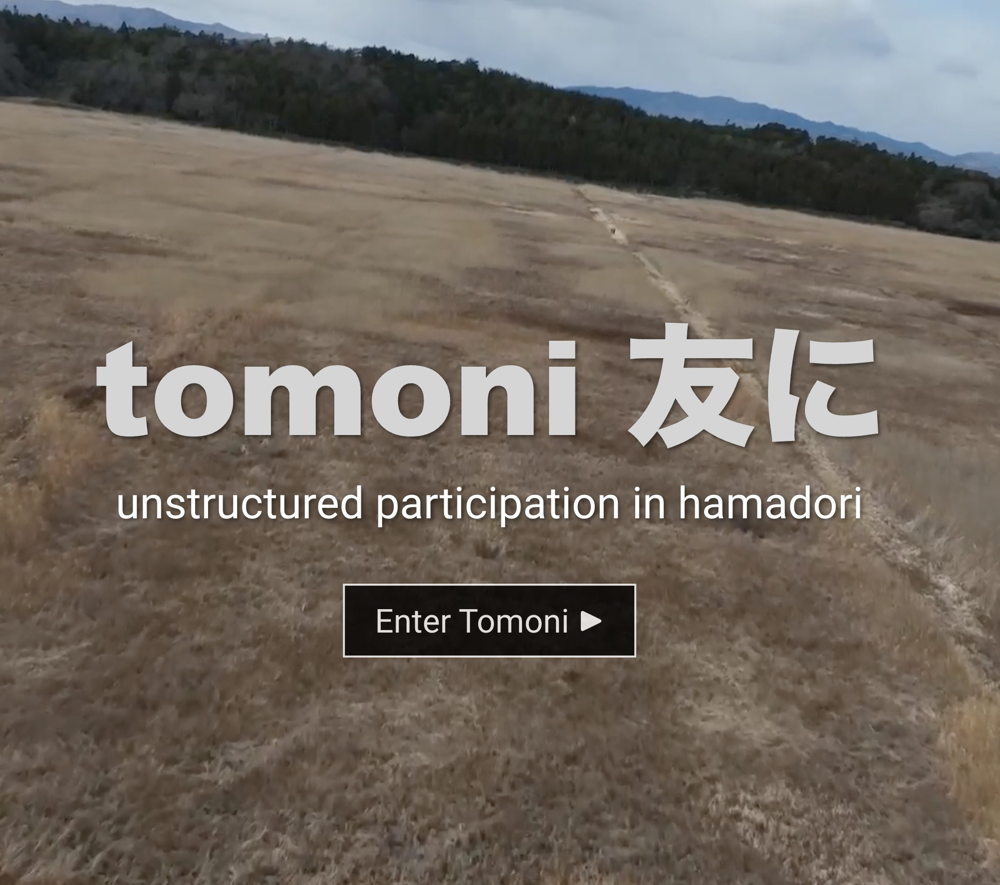

# MaChiZu

MaChiZu is a space that merges 

「町」(town) and 「地図」(maps)

We present a series of "thick maps," visual digital representations that evokes your imagination and provokes dialogue. Each piece is a confluence of urban digital expressions, experimentations that are constantly evolving, contestable and incomplete.

## Portfolio

	

		<a href="projects/xymax">
			
			
Tokyo 3D

		</a>
	

	

		<a href="https://yohman.github.io/pfhp/households.html" target="_blank">
			
			
Edo Families

		</a>
	

	

		<a href="https://lacmta.github.io/realtime-map/" target="_blank">
			
			
Metro LA Real-time Map

		</a>
	

	

		<a href="https://yohman.github.io/tomoni/site/" target="_blank">
			
			
Ethnography in Fukushima

		</a>
	

