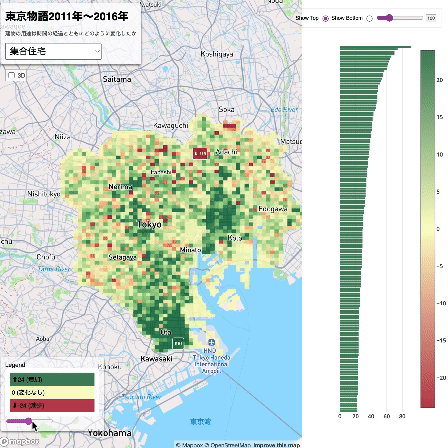
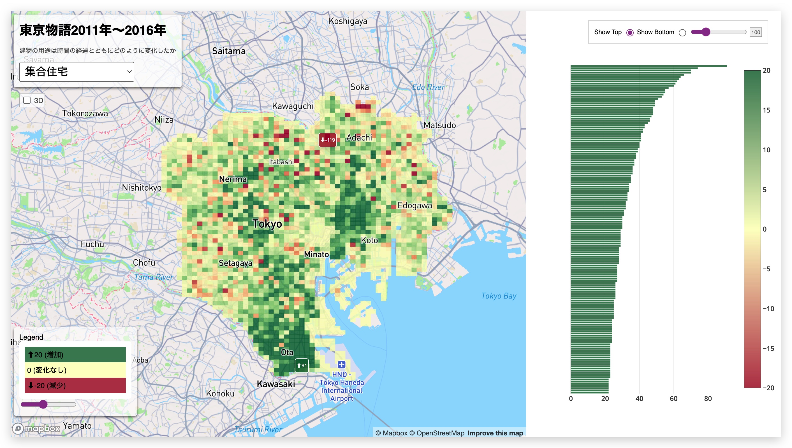

# 東京物語2011年〜2016年

*In partnership with [xymax Japan's research team](https://soken.xymax.co.jp/)*

How has urban space in metropolitan Tokyo changed in the 21st century? This digital map takes data from millions of buildings in Tokyo and compares their use codes from 2011 to 2016.

「建物の用途は時間の経過とともにどのように変化したか。」

→ [Enter site](https://yohman.github.io/xymax/buildinguse_change/)

## Features

### Changes from 2011 to 2016

### Different building uses

### 3D

### Switch to show either top increase or decrease 

### Change the color scale

<!-- 

 -->

→ [Enter site](https://yohman.github.io/xymax/buildinguse_change/)
